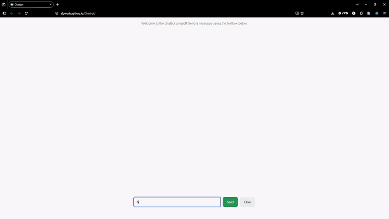
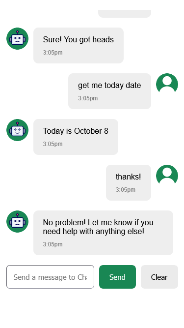

# 🤖 Chatbot Project

  

  <b>A chatbot website built using React.js</b>

---

## 📱 Responsive Demo

  

<b>Works on mobile phones!</b>

---

## 🚀 Live Demo

  <a href="https://elgworks.github.io/Chatbot/" target="_blank">
    Visit Live Site
  </a>

---

## 🛠️ Tech Stack

### Frontend

* **Vite 6.4.3** — Frontend build tool
* **React.js 19.3.0** — UI library
* **Day.js 1.11.23** — Date and time utility
* **SuperSimpleDev 8.6.4** — Project utility/library
* **ESLint 9.39.5** — Code linting